# Script Diagrams

> **역할**: 씬·오브젝트 연결, 클래스 관계, 런타임 흐름 **다이어그램 전용** 문서.  
> **코드 발췌·API 설명**은 [ScriptCodePreview.md](./ScriptCodePreview.md)를 본다.

---

## 목차

| Part | 내용 |
|------|------|
| **1** | [씬 아키텍처](#part-1--씬-아키텍처) — GameObject·Inspector·흐름도 |
| **2** | [클래스 다이어그램](#part-2--클래스-다이어그램) — 모듈별 관계·Singleton |

---

## Part 1 — 씬 아키텍처

현재 프로젝트의 주요 스크립트 참조 관계와 씬별 필수 오브젝트 연결을 정리한다.

## 전체 구조

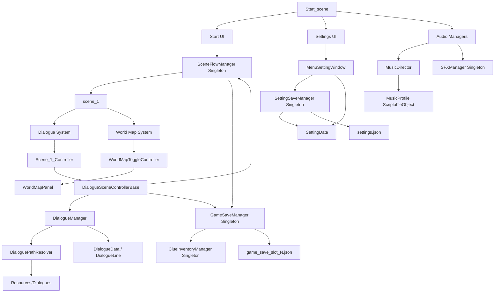

## scene_1 구성

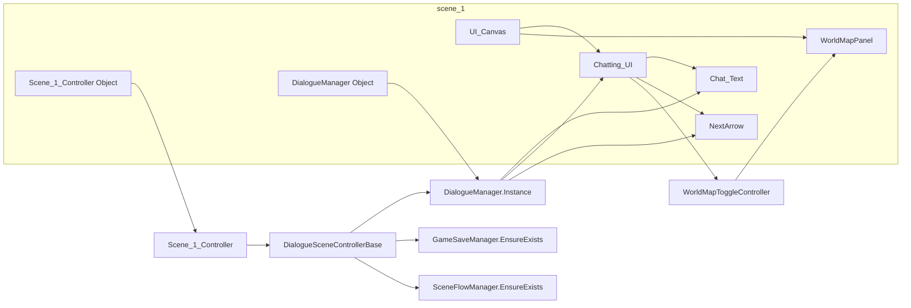

> `SceneFlowManager`, `GameSaveManager`, `SFXManager`, `ClueInventoryManager`는 전용 GameObject가 scene_1에 없어도 된다 — 전부 `MonoSingleton<T>` 기반이라 Start_scene에서 이미 떠 있으면 `DontDestroyOnLoad`로 그대로 넘어오고, 없으면 `EnsureExists()`가 그 자리에서 새로 만든다.

### scene_1 필수 연결

| 오브젝트 | 스크립트 | 필수 참조 |
| --- | --- | --- |
| `DialogueManager` | `DialogueManager` | `dialogueText`, `dialogueUI`, `nextArrow` |
| `Scene_1_Controller` | `Scene_1_Controller` | 기본 Flow: `Dialogues/Flows/Scene_1_Flow`, `ChapterName`: `Chapter01` |
| `Chatting_UI` 또는 별도 컨트롤러 오브젝트 | `WorldMapToggleController` | `worldMapPanel` |
| `WorldMapPanel` | 없음 또는 `Image` | 지도 Sprite가 없으면 검은 패널로 표시 |

## 대화 진행 흐름

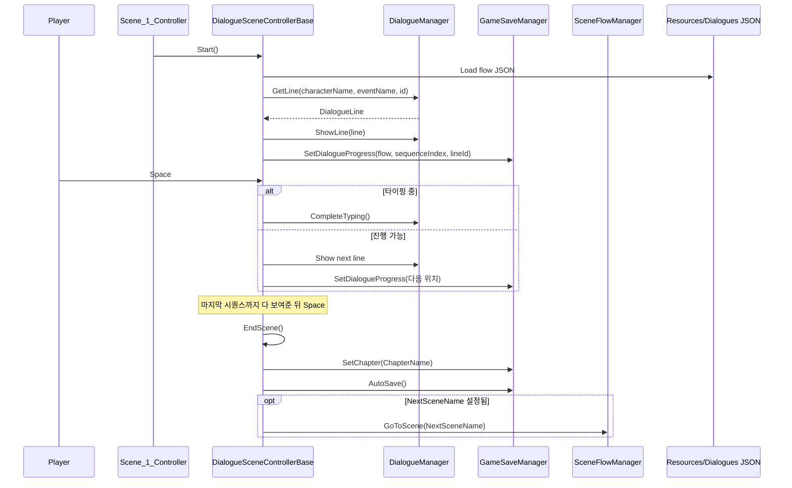

`SetDialogueProgress()`는 매 줄마다 메모리상의 `GameSaveData`만 갱신한다(디스크 쓰기 없음). 실제 파일 저장은 `AutoSave()`가 불릴 때만 일어난다 — 즉 한 씬(챕터)의 대화가 끝나는 시점에만 디스크에 기록된다.

## 세이브 흐름

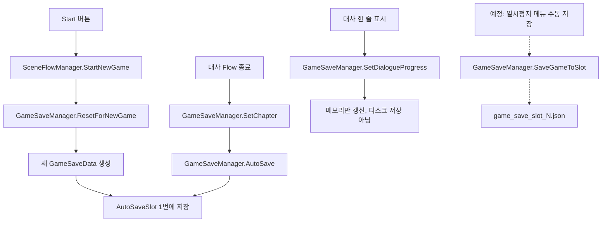

**슬롯 정책(합의됨, A안)**: 슬롯 1번(`GameSaveManager.AutoSaveSlot`)은 오토세이브 전용으로 예약. 수동 저장 UI가 생기면 슬롯 1번을 선택 못 하게 막아야 하는데, **이 보호 로직은 아직 코드에 없음**(의도적으로 미룸 — Part 1 하단 주의사항 참고).

## 씬 전환 흐름

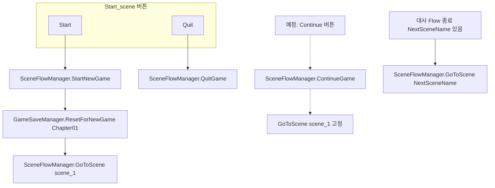

**알려진 제약**: `ContinueGame()`은 저장된 `currentChapter` 값과 상관없이 항상 `scene_1`로만 이동한다. 씬이 여러 개(scene_2 이상) 생기면 챕터 → 씬 이름 매핑 로직을 추가해야 한다. Continue 버튼 자체도 UI에 아직 없다 — 둘 다 의도적으로 미뤄둔 상태.

## 월드맵 흐름

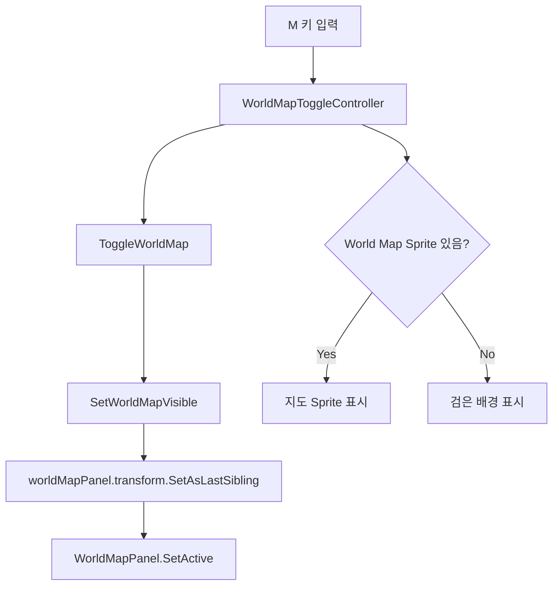

## Start_scene 구성

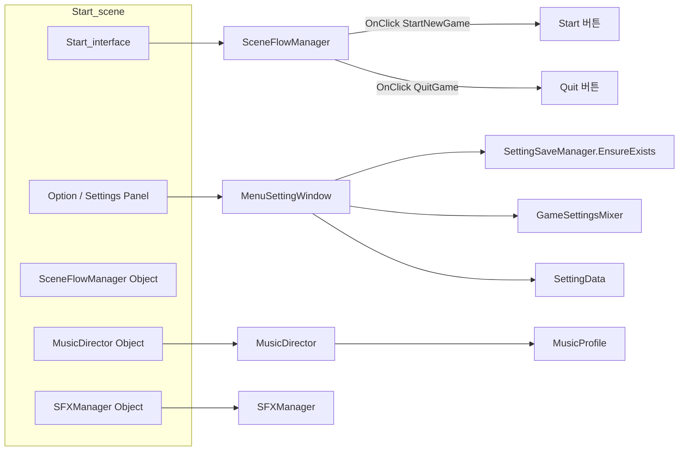

> `MusicDirector`는 싱글톤이 아니고 `DontDestroyOnLoad`도 없다 — Start_scene 전용 오브젝트라서 scene_1로 넘어가면 같이 파괴된다(재생 중이던 배경음도 끊김). `SFXManager`는 `MonoSingleton`이라 scene_1까지 그대로 유지된다. 이 둘의 동작 차이는 아직 실제로 다 확인된 건 아님(별도 브랜치 작업 예정).

### Start_scene 필수 연결

| 오브젝트 | 스크립트 | 필수 참조 |
| --- | --- | --- |
| `Option` 또는 설정 패널 | `MenuSettingWindow` | 볼륨 Slider, Text, Image, Resolution Dropdown, AudioMixer |
| `SceneFlowManager` | `SceneFlowManager` | 없음(순수 로직) — Start/Quit 버튼 OnClick에서 호출 |
| `SFXManager` | `SFXManager` | AudioSource, Button Click Clip |
| `MusicDirector` | `MusicDirector` | `playOnStart`(MusicProfile), `outputMixerGroup` |

## 데이터와 리소스 경로

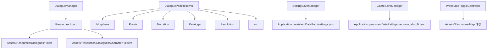

## 주의할 점

- `WorldMapPanel`은 `UI_Canvas` 아래에서 `Chatting_UI`보다 뒤쪽 sibling이어야 위에 보인다.
- `WorldMapToggleController`는 `WorldMapPanel` 자체가 아니라 항상 켜져 있는 오브젝트에 붙이는 것이 안전하다.
- `Resources.Load()` 경로에는 확장자를 쓰지 않는다.
- Unity에서 파일 또는 폴더를 이동할 때는 `.meta` 파일도 함께 이동한다.
- `scene_1`은 이제 `ProjectSettings/EditorBuildSettings.asset`에 등록되어 있다(과거엔 `Start_scene`만 등록돼서 `LoadScene`이 실패했음).
- 씬 전환은 전부 `SceneFlowManager.GoToScene(string)`을 거친다 — 다른 곳에서 직접 `SceneManager.LoadScene`을 부르지 않는다.
- 저장은 전부 `GameSaveManager`를 거친다 — 대사 진행상황(`SetDialogueProgress`)은 매 줄마다 메모리만 갱신하고, 실제 파일 쓰기(`AutoSave` / `SaveGameToSlot`)는 챕터 종료 시점 또는 향후 수동 저장 시점에만 일어난다.
- 대사 도중 씬 전환 없이 다른 이벤트 콘텐츠를 끼워 넣는 기능(예: 서브 대화)은 아직 데이터 구조·컨트롤러 로직에 반영 안 됨 — 지금은 컨트롤러 하나가 flow 하나만 순차 진행하는 것을 전제로 함.
- 대사 선택지(분기) 기능도 아직 없음 — `DialogueLine`/`DialogueSequence`에 분기 필드 자체가 없어서, `Advance()`는 항상 배열 순서대로만 진행한다.

---

## Part 2 — 클래스 다이어그램

### 2.0 범례

- `──▶` : 사용/호출 (런타임)
- `- - ▶` : SerializeField / Inspector 연결
- `◆` : Singleton 또는 static Instance (다이어그램 범례용 — Mermaid 본문에는 ASCII만 사용)
- `(abstract)` : 추상 클래스 → Mermaid에서는 `<<abstract>>`
- `(data)` : 직렬화 데이터, MonoBehaviour 아님
- `(editor)` : `#if UNITY_EDITOR` 전용

> **GitHub Mermaid 주의**: `◆`, `(data)`, 파일명의 `.`(점), `→` 같은 기호는 렌더 오류를 일으킬 수 있어 다이어그램 본문에서는 피한다.

---

### 2.1. 전체 클래스 관계 (한 장 요약)

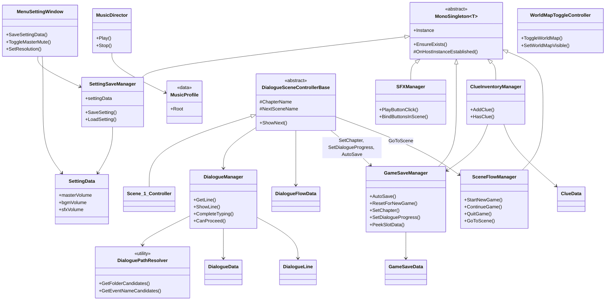

**파일명 ↔ 클래스명**

| 파일 | 클래스 |
|------|--------|
| `MenuSettingScript.cs` | `MenuSettingWindow` |

---

### 2.2. Settings 모듈

**포함 스크립트**: `SettingSaveManager`, `SettingData`, `MenuSettingWindow`

> **Mermaid 레이아웃**: GitHub Mermaid에는 선·라벨 **겹침 방지 옵션이 없습니다.**  
> `direction LR` + 같은 노드에서 나가는 화살표가 많으면 라벨이 겹치기 쉽습니다. **세로 배치(`flowchart TB`)·subgraph·노드 순서**로 피합니다.

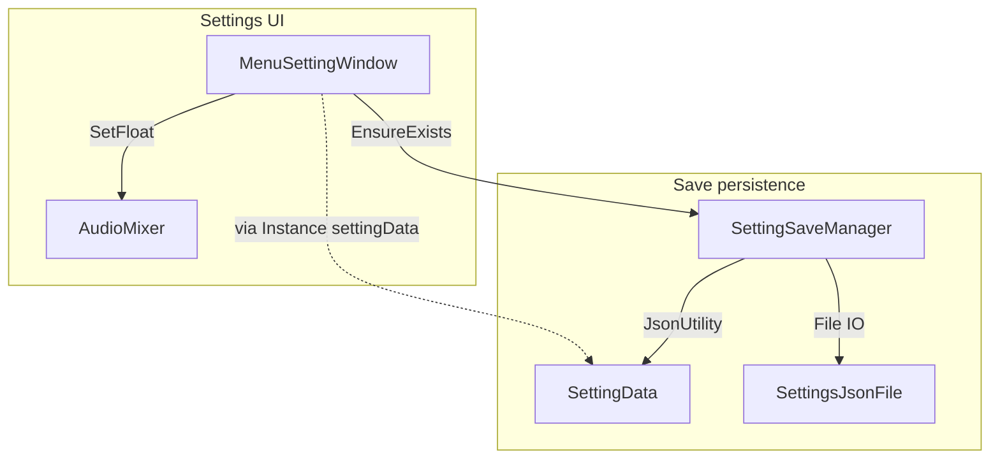

`persistence` subgraph 안에서 **SettingData(위) → SettingSaveManager(중간) → SettingsJsonFile(아래)** 순으로 두어, SettingSaveManager에서 나가는 두 화살표·라벨이 서로 다른 방향으로 그려지게 했습니다.

**관계 메모**

| 항목 | 내용 |
|------|------|
| `EnsureExists()` 호출처 | `MenuSettingWindow.Awake/Start` |
| AudioMixer 연결 | 1) Inspector `[SerializeField] mixer` 2) 없으면 `Resources.Load("GameSettingsMixer")` 시도. 실제 에셋: `Assets/Features/GameSettingsMixer.mixer` (Resources 아님 → **Inspector 할당 권장**) |
| 노출 파라미터 | `MasterVolume`, `BGMVolume`, `SFXVolume` |
| 싱글톤 방식 | `MonoSingleton<SettingSaveManager>` 상속 — `Instance`/`EnsureExists()`는 공통 베이스에서 제공 |

---

### 2.3. Dialogue 모듈

**포함 스크립트**: `DialogueManager`, `DialoguePathResolver`, `DialogueLine.cs`, `DialogueSceneControllerBase`, `Scene_1_Controller`

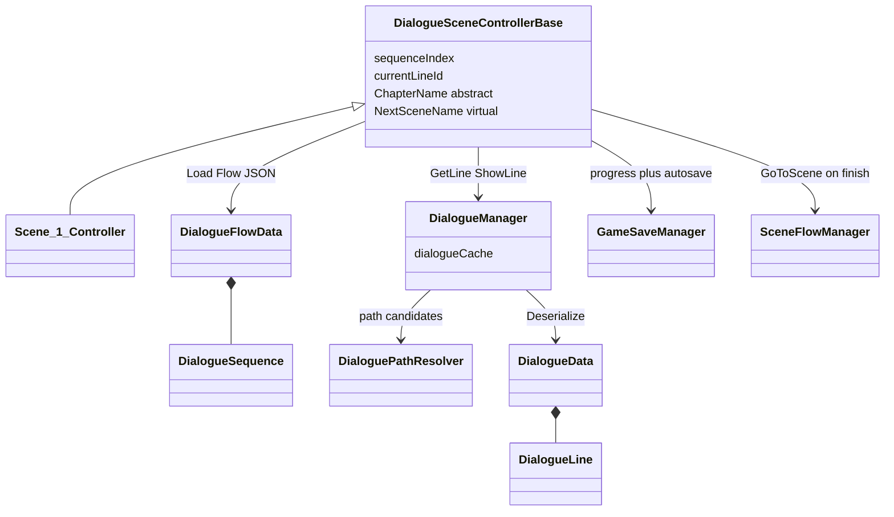

**Flow → Line 호출 체인**

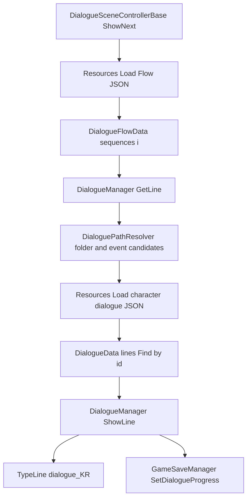

텍스트 요약: `Load(Flow)` → `sequences[i]` → `GetLine` → `DialoguePathResolver` → `Load(Dialogues/...)` → `Find(id)` → `ShowLine` → `TypeLine` + `SetDialogueProgress`

**Flow 종료 시점**: 마지막 시퀀스까지 다 보여준 뒤 `EndScene()` → `OnDialogueFlowFinished()`에서 `SetChapter(ChapterName)` + `AutoSave()` + (`NextSceneName` 있으면) `SceneFlowManager.GoToScene()`.

**캐릭터명 → Resources 폴더 매핑** (`DialoguePathResolver`)

| JSON characterName | 폴더 |
|--------------------|------|
| 모피어스 | Morpheus |
| 프레시아 | Presia |
| 나레이션 | Narration |
| 패트리지 | Partridge |
| 혁명군 / 혁명군A / 혁명군B | Revolution |
| 상인 / 상인A / 선생님 / 조력자 / 조력자A / 조력자B | etc |

탐색 순서: 매핑 폴더 → characterName 그대로 → eventName 접두사 → `etc` fallback.

**이벤트명 보정**: `Patridge_*` → `Partridge_*`

---

### 2.4. UI / World Map 모듈

**포함 스크립트**: `WorldMapToggleController`

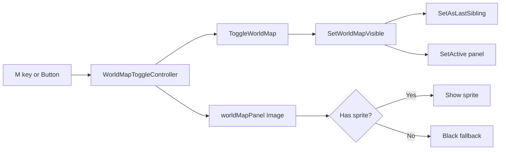

**관계 메모**

- `worldMapPanel` 미연결 시 **자기 GameObject**를 패널로 사용.
- `WorldMapPanel` 자체가 아닌, **항상 활성인 오브젝트**(예: `Chatting_UI`)에 스크립트를 붙이는 것이 안전 (본 문서 Part 1 참고).
- `scene_1`에서 `Chatting_UI` → `WorldMapPanel` 참조 구조.

---

### 2.5. Sound 모듈

**포함 스크립트**: `SFXManager`, `MusicDirector`, `MusicProfile`, `MusicNode`(및 6개 서브클래스), `MusicNodeDrawer`/`MusicProfileEditor`(editor)

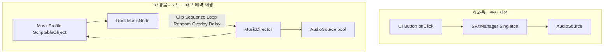

**관계 메모**

| 항목 | 내용 |
|------|------|
| `SFXManager` 생명주기 | `MonoSingleton<SFXManager>` — `DontDestroyOnLoad`, 씬 바뀔 때마다 새 Button에 클릭음 자동 바인딩 |
| `MusicDirector` 생명주기 | 싱글톤 아님, `DontDestroyOnLoad` 없음 — **Start_scene 전용**, scene_1로 넘어가면 같이 파괴됨(재생 끊김 가능) |
| `MusicNode` 종류 | `MusicClipNode`(단일 클립), `MusicSequenceNode`(순차), `MusicLoopNode`(반복), `MusicRandomNode`(무작위), `MusicOverlayNode`(동시 재생), `MusicDelayNode`(대기) — 전부 `SerializeReference` 기반 다형성 |
| 재생 방식 | `AudioSettings.dspTime` + `PlayScheduled`로 미리 예약해서 끊김 없는 재생 구현 |
| 볼륨/뮤트 | `MusicDirector`/`SFXManager`엔 볼륨 로직 없음 — `MenuSettingWindow`가 AudioMixer dB만 조절, AudioSource가 해당 Mixer 그룹에 물려있어야 실제로 반영됨(Inspector 설정 필요) |

---

### 2.6. Save / Progress 모듈

**포함 스크립트**: `MonoSingleton<T>`, `GameSaveManager`, `GameSaveData`

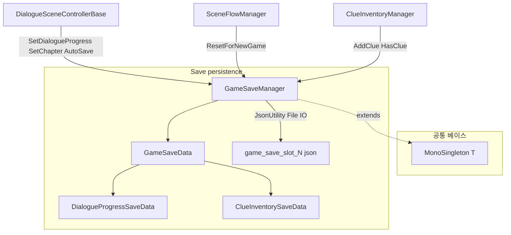

**관계 메모**

| 항목 | 내용 |
|------|------|
| 슬롯 범위 | `MinSaveSlot`=1, `MaxSaveSlot`=3, `AutoSaveSlot`=1(=`MinSaveSlot`) |
| `AutoSave()` | 항상 `AutoSaveSlot`에 저장. 수동 저장(`SaveGameToSlot`)과 진입점을 분리해서 의도를 코드로 드러냄 |
| `ResetForNewGame(chapterName)` | 메모리상의 `GameSaveData`를 완전히 새로 만들고 지정 챕터로 세팅한 뒤 `AutoSave()` — "새 게임" 버튼에서만 사용 |
| `SetDialogueProgress()` | 디스크에 안 씀, 메모리만 갱신 — 대사 한 줄 보여줄 때마다 호출됨 |
| `PeekSlotData(slot)` | 현재 활성 슬롯 안 건드리고 다른 슬롯 파일만 읽음 — 저장 메뉴 미리보기용, 아직 UI 없음 |
| **미구현** | 오토세이브 슬롯을 수동 저장으로부터 보호하는 로직(코드 레벨 가드) — 저장 메뉴 만들 때 추가 예정 |

---

### 2.7. Clue 모듈

**포함 스크립트**: `ClueInventoryManager`, `ClueData`

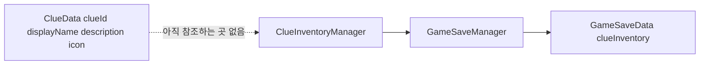

**관계 메모**

- `ClueInventoryManager`는 상태를 직접 안 들고, 전부 `GameSaveManager.Data.clueInventory`에 위임한다(단서 목록 저장 위치는 GameSaveManager 하나).
- **아직 게임플레이/UI 어디서도 `AddClue`/`HasClue`를 부르지 않는다** — 데이터 구조와 매니저만 준비된 상태, 실제 단서 획득 이벤트는 미구현.

---

### 2.8. Scene Flow 모듈

**포함 스크립트**: `SceneFlowManager`

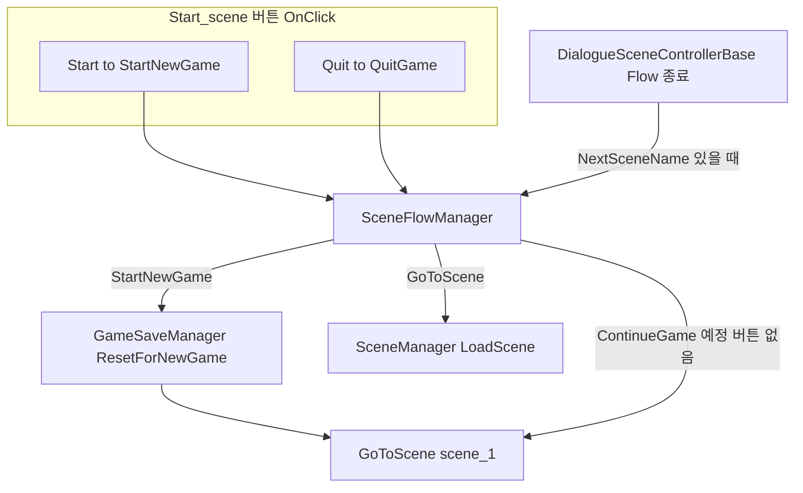

**현재 코드 상태**

| 진입점 | 코드 | 상태 |
|--------|------|------|
| `SceneFlowManager.StartNewGame()` | `GameSaveManager.ResetForNewGame("Chapter01")` 후 `GoToScene("scene_1")` | 동작 확인됨(대사 끝까지 진행 + 세이브 파일 생성 검증 완료) |
| `SceneFlowManager.ContinueGame()` | `GoToScene("scene_1")` 고정 | 코드만 있음, UI 버튼 없음, 챕터별 씬 매핑 없음 |
| `SceneFlowManager.QuitGame()` | 에디터/빌드 종료 | 동작 확인됨 |
| `SceneFlowManager.GoToScene(name)` | `SceneManager.LoadScene(name)` | 모든 씬 전환의 단일 진입점 |

팀 작업 시 챕터가 여러 씬으로 늘어나면 `ContinueGame()`에 챕터 → 씬 이름 매핑을 추가해야 한다.

---

### 2.9. Singleton / Static 패턴 정리표

| 타입 | 클래스 | 접근 방식 | 생명주기 |
|------|--------|-----------|----------|
| 공통 베이스 | `MonoSingleton<T>` | `Instance` + `EnsureExists()` | `DontDestroyOnLoad`, 하위 클래스가 `OnHostInstanceEstablished()`로 초기화 훅 사용 |
| Singleton (MonoSingleton) | `GameSaveManager` | `EnsureExists()` | `DontDestroyOnLoad` |
| Singleton (MonoSingleton) | `ClueInventoryManager` | `EnsureExists()` | `DontDestroyOnLoad` |
| Singleton (MonoSingleton) | `SettingSaveManager` | `EnsureExists()` | `DontDestroyOnLoad` |
| Singleton (MonoSingleton) | `SFXManager` | `EnsureExists()` | `DontDestroyOnLoad` |
| Singleton (MonoSingleton) | `SceneFlowManager` | `EnsureExists()` | `DontDestroyOnLoad` |
| Singleton (독자 구현) | `DialogueManager` | `Instance` (private set) | **씬 내 1개.** `DontDestroyOnLoad` 없음 |
| 일반 MonoBehaviour | `MusicDirector` | 없음(직접 참조) | 씬 로컬, `DontDestroyOnLoad` 없음 |
| Static | `DialoguePathResolver` | static 메서드만 | — |

> `GlobalData`(static 필드로 씬 간 값 전달)는 삭제됨 — 챕터/진행 상태는 이제 `GameSaveManager`(DontDestroyOnLoad 싱글톤) 하나로 통일.

---

### 2.10. Editor 전용 (런타임 빌드 제외)

| 파일 | 클래스 | 용도 |
|------|--------|------|
| `Assets/Features/Editor/SsalBootstrapAudioMixer.cs` | `SsalBootstrapAudioMixer` | 메뉴 `SSAL/Audio Mixer 설정 안내` — Mixer 생성 절차 안내 (자동 생성 X) |
| `Assets/Features/Editor/SettingSaveManagerJsonEditorTest.cs` | `SettingSaveManagerJsonEditorTest` | 메뉴 `SSAL/Test settings.json 저장·로드` — JsonUtility I/O 검증 |
| `Assets/Features/Scripts/Sound/Editor/MusicProfileEditor.cs` | `MusicProfileEditor` | `MusicProfile` ScriptableObject 커스텀 인스펙터 |
| `Assets/Features/Scripts/Sound/Editor/MusicNodeDrawer.cs` | `MusicNodeDrawer` | `SerializeReference` 기반 `MusicNode` 트리 PropertyDrawer |
